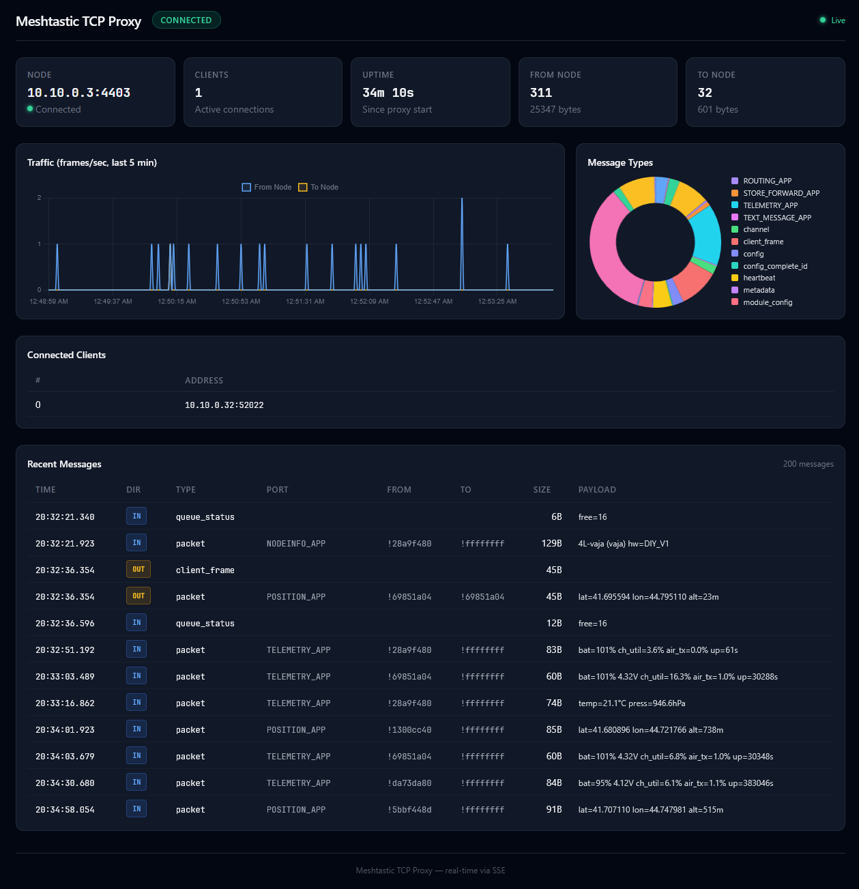

# Meshtastic Proxy

A TCP proxy for [Meshtastic](https://meshtastic.org/) LoRa mesh radio nodes. Connects to a single Meshtastic node over TCP and multiplexes the connection across multiple clients (iOS/Android Meshtastic app, Python CLI, etc.).



## Features

- **Multi-client multiplexing** — multiple apps connect simultaneously to one radio node
- **Cached config replay** — node configuration is cached on first connect and delivered instantly to new clients, eliminating slow re-reads from the radio
- **iOS two-phase config** — supports special firmware nonces (`69420`/`69421`) used by the iOS Meshtastic app for split config + node database loading
- **mDNS advertisement** — advertises as `_meshtastic._tcp` so Meshtastic apps auto-discover the proxy on the local network
- **Web dashboard** — real-time traffic graphs, message types breakdown, connected clients list, node map with RSSI/SNR heat map overlay, mesh chat with channel support, traceroute to nodes, and recent message log via SSE
- **Prometheus metrics** — `/metrics` endpoint exposing proxy traffic, connection reliability, mesh node counts, per-node RSSI and SNR, and message breakdowns by port type, plus Go runtime and process metrics
- **Grafana dashboard** — pre-built JSON dashboard with overview stats, traffic rates, message type distribution, RF signal quality (RSSI/SNR per node), connection reliability, and Go runtime panels
- **Kubernetes-ready** — manifests for `hostNetwork` deployment with mDNS on bare-metal clusters

## Architecture

```
Meshtastic Node (TCP :4403)
        │
   node.Connection          ← persistent TCP, auto-reconnect, config caching
        │
   proxy.Proxy              ← accept clients, broadcast FromRadio, relay ToRadio
   ├── proxy.Client[0]      ← per-client read/write loops + send channel
   ├── proxy.Client[1]
   └── ...
        │
   Other components:
   ├── discovery.Advertiser  ← mDNS (_meshtastic._tcp), multi-interface support
   ├── web.Server            ← HTTP dashboard + SSE + Prometheus /metrics
   └── metrics.Metrics       ← counters, ring buffers, pub/sub, Prometheus collector
```

## Quick Start

### Prerequisites

- Go 1.24+ (or run `make setup` to install)
- A Meshtastic node reachable over TCP (default port `4403`)

### Build and Run

```bash
cp config.example.toml config.toml
# Edit config.toml — set your node address
make run
```

The proxy listens on `:4404` for Meshtastic clients and `:8080` for the web dashboard by default.

### Docker

```bash
cp config.example.toml config.toml
# Edit config.toml
docker compose up -d
```

Image: `ghcr.io/jf3tt/meshtastic-proxy:latest`

### Kubernetes

Target environment: bare-metal cluster with `hostNetwork` for mDNS multicast support.

```bash
kubectl apply -f deploy/kubernetes/namespace.yaml
kubectl apply -f deploy/kubernetes/configmap.yaml
kubectl apply -f deploy/kubernetes/deployment.yaml
kubectl apply -f deploy/kubernetes/service.yaml
```

| Manifest | Resource | Purpose |
|---|---|---|
| `namespace.yaml` | Namespace `meshtastic` | Privileged PSS for hostNetwork |
| `configmap.yaml` | ConfigMap | TOML config |
| `deployment.yaml` | Deployment | Pod with hostNetwork, HTTP health probes on web port |
| `service.yaml` | Service (LoadBalancer) | Exposes web dashboard via MetalLB |

## Monitoring

### Prometheus Metrics

The proxy exposes a `/metrics` endpoint on the web server port (default `:8080`) with the following metrics:

| Metric | Type | Description |
|---|---|---|
| `meshtastic_proxy_info` | Gauge | Proxy instance info (label: `node_address`) |
| `meshtastic_proxy_uptime_seconds` | Gauge | Seconds since proxy started |
| `meshtastic_proxy_node_connected` | Gauge | Node TCP connection status (1=up, 0=down) |
| `meshtastic_proxy_active_clients` | Gauge | Currently connected proxy clients |
| `meshtastic_proxy_bytes_from_node_total` | Counter | Bytes received from node |
| `meshtastic_proxy_bytes_to_node_total` | Counter | Bytes sent to node |
| `meshtastic_proxy_frames_from_node_total` | Counter | Frames received from node |
| `meshtastic_proxy_frames_to_node_total` | Counter | Frames sent to node |
| `meshtastic_proxy_node_reconnects_total` | Counter | Node reconnection count |
| `meshtastic_proxy_node_connection_errors_total` | Counter | Node connection error count |
| `meshtastic_proxy_config_cache_frames` | Gauge | Frames held in config cache |
| `meshtastic_proxy_config_cache_age_seconds` | Gauge | Seconds since cache was last populated |
| `meshtastic_proxy_config_replays_total` | Counter | Config replays by type (`full`, `config_only`, `nodes_only`) |
| `meshtastic_proxy_messages_total` | Counter | Messages by `port_num` (e.g. `POSITION_APP`, `TEXT_MESSAGE_APP`) |
| `meshtastic_proxy_mesh_nodes` | Gauge | Known nodes in the mesh network |
| `meshtastic_proxy_node_rssi_dbm` | Gauge | Last received RSSI in dBm per node (labels: `node_num`, `short_name`) |
| `meshtastic_proxy_node_snr_db` | Gauge | Last received SNR in dB per node (labels: `node_num`, `short_name`) |

Standard `go_*` and `process_*` metrics are also included.

### Grafana Dashboard

A pre-built Grafana dashboard is provided at [`deploy/grafana/grafana-dashboard.json`](deploy/grafana/grafana-dashboard.json). Import it into Grafana manually or provision it via your preferred method (file provisioning, API, Grafana sidecar, etc.). The dashboard includes:

- **Overview** — node status, uptime, active clients, mesh nodes, config cache stats
- **Traffic** — frame rate, byte rate, and cumulative traffic (bidirectional)
- **Messages** — donut chart by port type, stacked message rate over time, total count
- **RF Signal Quality** — RSSI and SNR per node over time, signal quality table with color-coded thresholds
- **Connection Reliability** — reconnect rate, error rate, config replay rate
- **Go Runtime** (collapsed) — goroutines, memory, GC duration, CPU usage

## Configuration

All settings are in a single TOML file. See [`config.example.toml`](config.example.toml) for the full reference.

```toml
[node]
address = "192.168.1.100:4403"
reconnect_interval = "1s"
max_reconnect_interval = "30s"

[proxy]
listen = ":4404"
max_clients = 10

[web]
listen = ":8080"
enabled = true

[mdns]
enabled = true
instance = "Meshtastic Proxy"
short_name = "PRXY"
# interfaces = ["eth0"]  # restrict mDNS to specific interfaces

[logging]
level = "info"    # debug, info, warn, error
format = "text"   # text, json
```

### mDNS Interface Selection

When running on Kubernetes with `hostNetwork: true`, the host may have many virtual interfaces (Cilium, Flannel, etc.). Use the `interfaces` list to restrict mDNS advertisements to your LAN interface only:

```toml
[mdns]
interfaces = ["eth0"]
```

When `interfaces` is empty or omitted, the system default multicast interface is used.

## Wire Protocol

Meshtastic TCP uses a 4-byte frame header followed by a protobuf payload:

```
[0x94] [0xC3] [len_hi] [len_lo] [protobuf payload ...]
```

- **Node → Proxy → Clients**: `FromRadio` protobuf (config, mesh packets, telemetry)
- **Clients → Proxy → Node**: `ToRadio` protobuf (packets, config requests)

The proxy intercepts two `ToRadio` types from clients:

| Frame | Action | Reason |
|---|---|---|
| `want_config_id` | Reply from cache | Prevents re-reading config from the radio |
| `disconnect` | Close client locally | Prevents tearing down the shared node connection |

All other frames pass through unmodified.

## Development

### Commands

```bash
make build          # build binary to ./bin/
make test           # go test -v -race ./...
make lint           # go vet + golangci-lint
make run            # build + run with config.toml
make docker         # docker compose build
make docker-up      # docker compose up -d
make install-hooks  # enable pre-commit hook (vet + test + lint)
```

### Project Structure

```
cmd/meshtastic-proxy/    Entry point, wiring, signal handling
internal/
├── config/              TOML config loading & validation
├── node/                Persistent TCP connection to Meshtastic node
├── proxy/               Client hub, broadcast, cached config replay
├── protocol/            Binary frame encoding (magic + length + protobuf)
├── discovery/           mDNS advertisement (hashicorp/mdns)
├── metrics/             Runtime stats, traffic time-series, SSE pub/sub, Prometheus collector
└── web/                 HTTP server, dashboard, SSE endpoint, /metrics
deploy/
├── grafana/             Grafana dashboard JSON
└── kubernetes/          Namespace, ConfigMap, Deployment, Service manifests
```

### Testing

All tests must pass with the race detector:

```bash
go test -race -v ./...
```